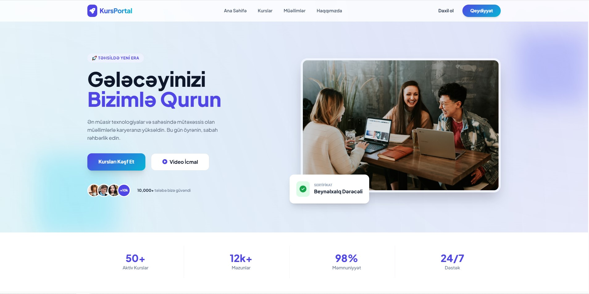
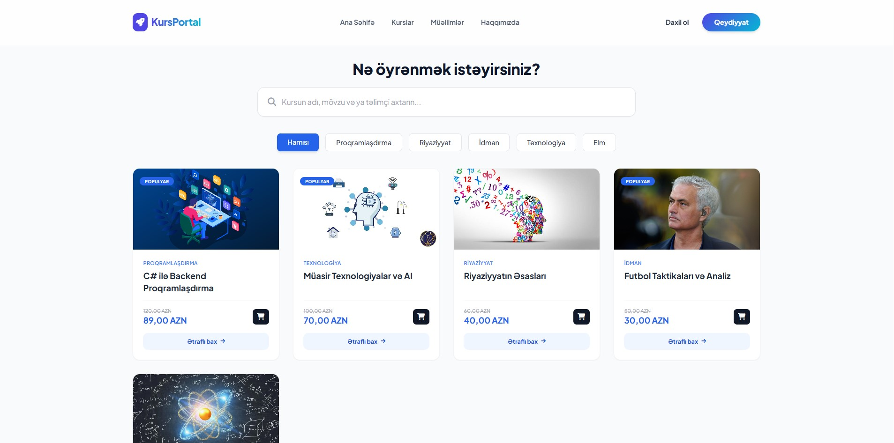
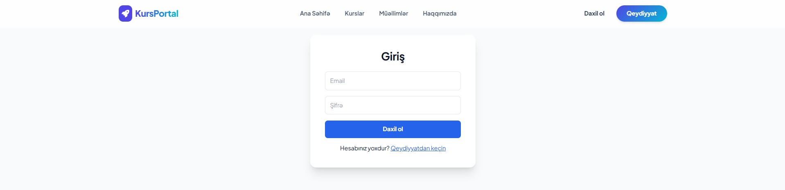
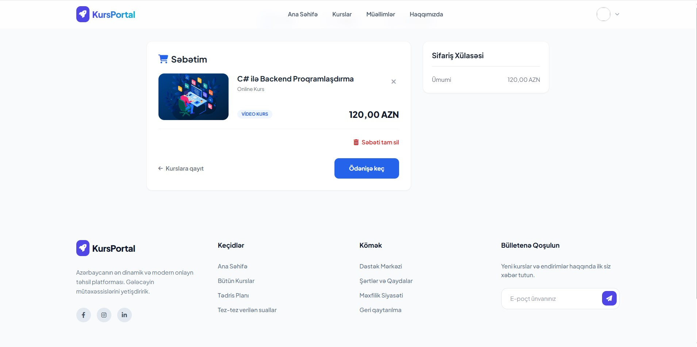
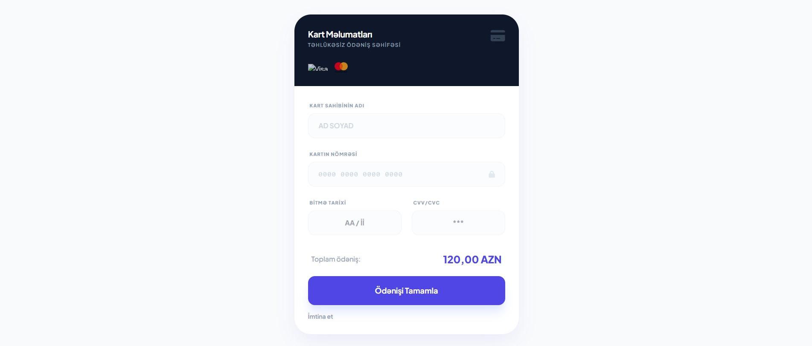
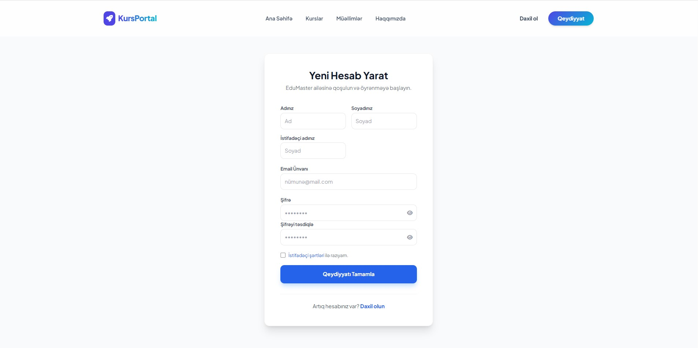

# 🔹 Layihə haqqında

Bu layihə **ASP.NET Core** texnologiyaları əsasında hazırlanmış kurs platformasıdır və **N-Layered Architecture** prinsiplərinə uyğun şəkildə qurulmuşdur. Tətbiqdə biznes məntiqi, verilənlərə çıxış və təqdimat qatları bir-birindən ayrılaraq daha səliqəli və idarə oluna bilən struktur təmin edilmişdir.

Sistem daxilində əməliyyatlar **Web API** üzərindən idarə olunur və istifadəçi interfeysi bu servislərlə qarşılıqlı əlaqə quraraq məlumatları təqdim edir. Bu yanaşma tətbiqin daha çevik, genişlənə bilən və müstəqil inkişaf etdirilə bilən olmasına imkan yaradır.

İstifadəçi qeydiyyatı və autentifikasiya prosesləri **ASP.NET Core Identity** vasitəsilə həyata keçirilmişdir. Sistemdə **Admin**, **Teacher** və **Student** rolları mövcuddur və hər rol üçün uyğun səlahiyyətlər tətbiq edilmişdir.

---

## 👨‍🎓 Student
- Kursları görüntüləyə bilər
- Kurs satın ala bilər
- Satın aldığı kurslara çıxış əldə edir

---

## 👨‍🏫 Teacher
- Yeni kurs yarada bilər
- Öz kurslarını redaktə və silə bilər
- Yalnız öz kursları üzərində idarəetmə səlahiyyətinə malikdir

---

## 🛠 Admin
- Bütün kurslar üzərində tam idarəetmə hüququna malikdir
- İstifadəçiləri idarə edə bilər
- Sistem üzrə ümumi nəzarət və idarəetməni həyata keçirir

---

## 🛒 Cart & Order System
- 🔹 Cart (Səbət) funksionallığı
- Kursun səbətə əlavə olunması
- Səbətdən kurs silinməsi
- Səbətin tam təmizlənməsi
- Ümumi məbləğin hesablanması
- İstifadəçiyə məxsus səbətin idarə olunması

- 🔹 Order (Sifariş) funksionallığı
- Checkout əməliyyatı
- Sifariş yaradılması
- Sifariş detallarının saxlanılması
- İstifadəçinin sifariş tarixçəsinin əldə olunması
- Satın alınmış kursların istifadəçi hesabına avtomatik əlavə olunması

  
---

## 🔹 İstifadə olunan texnologiyalar
- ASP.NET Core MVC
- ASP.NET Core Web API
- ASP.NET Core Identity
- Entity Framework Core
- SQL Server
- Repository Pattern (N-Layer Architecture daxilində)
- HTML / CSS / JavaScript

---

## 🔹 Layihənin vəziyyəti
Layihə hazırda əsas funksionallıqlar baxımından tamamlanma mərhələsinə yaxındır. Bəzi əlavə funksiyalar və optimizasiya işləri üzərində inkişaf davam edir.

---

## 📸 Screenshots

### 🏠 Home Page

### 📚 Courses Page

### 🔐 Login Page

### 🛒 Cart

###  📦  Order 

### 📝 Register Page

